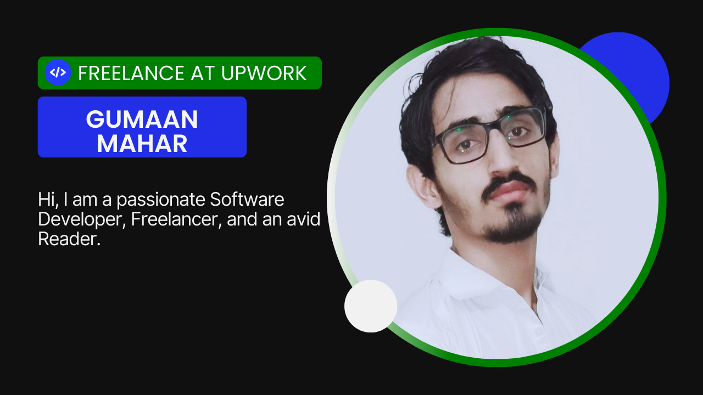

# Gumaan Mahar

---

 

---

**About Me:**
- 🔭 Currently working as an Upwork Freelancer.
- 🌱 Exploring Frontend & Backend functionalities for both Web and Mobile.
- 🤝 Open to collaboration on exciting projects.
- 📫 Reach me at: gumaanmahar@gmail.com

---

## Stuff I'm Familiar With 🚀✅:

  
  
  
  
  
  
  
  
  
  
  
  
  

---

## My GitHub Profile Stats 📊✅:

 
  
  

 
  

 
   

---

## Featured Projects 🚀:

- [Passtop (Encrypted Password Manager)](https://github.com/Gumaan-Mahar/Passtop)
- [E-Commerce-UI](https://github.com/Gumaan-Mahar/e-commerce-ui)
- [MyNotes Project](https://github.com/Gumaan-Mahar/MyNotes)

---

*Thank you for visiting! Feel free to explore my projects and get in touch.* 😊
